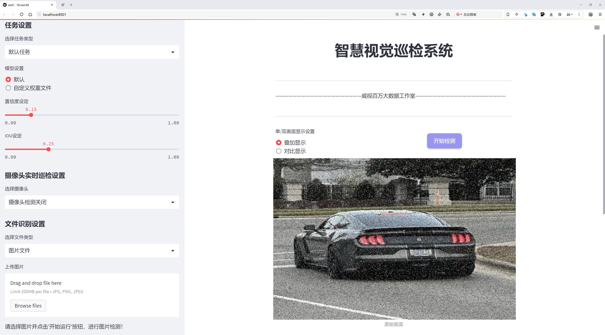
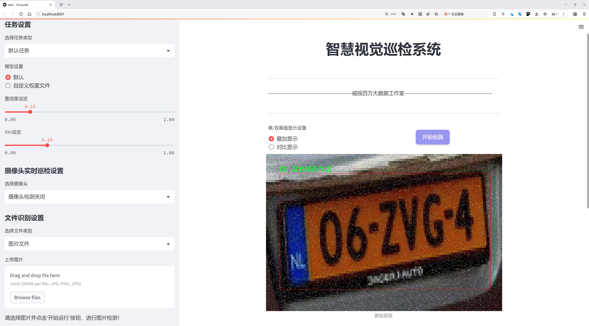
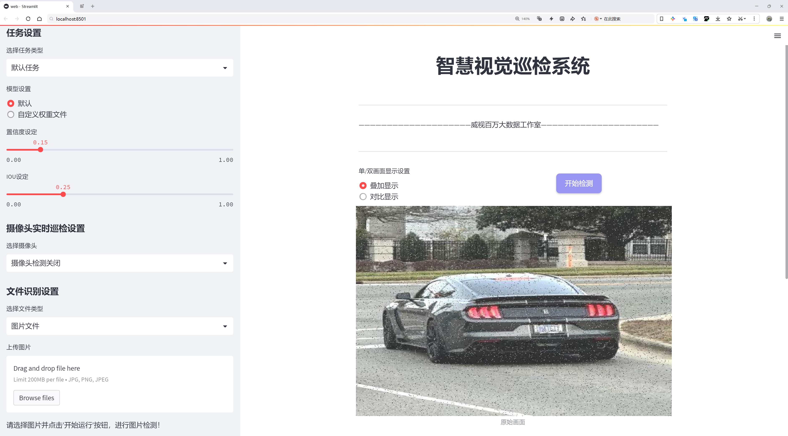
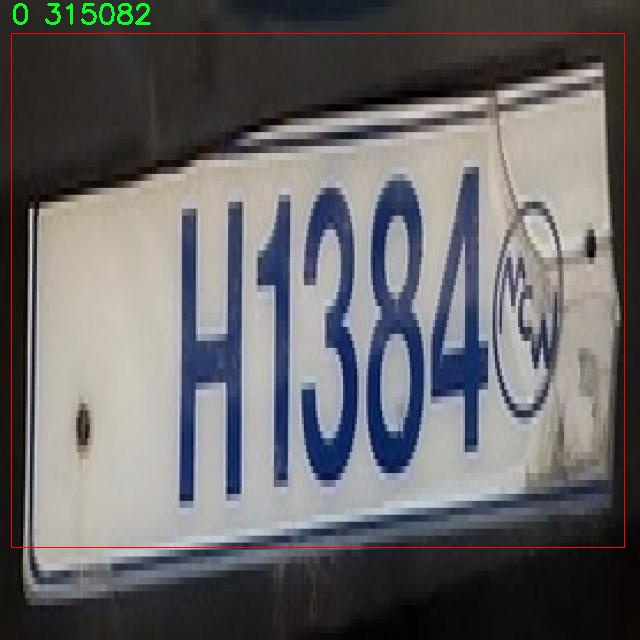
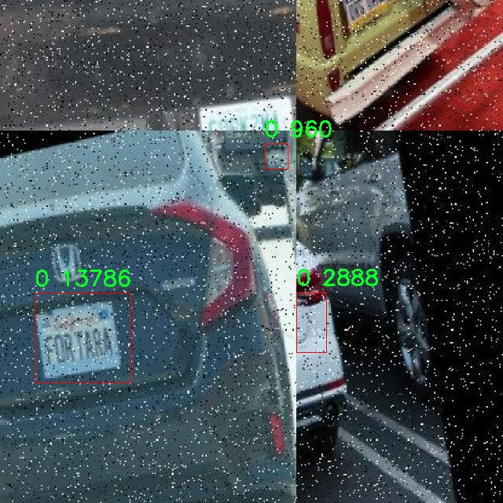

# 车牌识别检测系统源码分享
 # [一条龙教学YOLOV8标注好的数据集一键训练_70+全套改进创新点发刊_Web前端展示]

### 1.研究背景与意义

项目参考[AAAI Association for the Advancement of Artificial Intelligence](https://gitee.com/qunshansj/projects)

项目来源[AACV Association for the Advancement of Computer Vision](https://gitee.com/qunmasj/projects)

研究背景与意义

随着智能交通系统的快速发展，车牌识别技术在交通管理、车辆监控和智能停车等领域得到了广泛应用。车牌识别不仅能够提高交通管理的效率，还能为城市安全提供重要的数据支持。近年来，深度学习技术的进步使得目标检测领域取得了显著的突破，尤其是YOLO（You Only Look Once）系列模型的提出，极大地提升了实时目标检测的性能和准确性。YOLOv8作为该系列的最新版本，凭借其高效的特征提取能力和快速的推理速度，成为车牌识别系统的理想选择。

然而，尽管YOLOv8在目标检测任务中表现出色，但在特定应用场景下，如车牌识别，仍然面临一些挑战。首先，车牌的外观和尺寸因地区、国家而异，导致模型在不同类型车牌上的泛化能力不足。其次，车牌在不同光照、天气条件下的可见性变化，也会影响识别的准确性。此外，车牌的背景复杂多变，可能存在其他干扰物体，这也给车牌的检测和识别带来了困难。因此，基于YOLOv8的改进车牌识别系统的研究具有重要的现实意义。

本研究将基于一个包含3720张图像的车牌检测数据集进行，数据集中包含两个类别，主要针对车牌对象的检测。这一数据集为模型的训练和评估提供了基础，能够帮助我们深入分析车牌识别过程中的各种影响因素。通过对数据集的细致分析和模型的改进，我们期望能够提升YOLOv8在车牌识别任务中的准确性和鲁棒性。

改进YOLOv8的车牌识别系统不仅能够提高车牌检测的准确率，还能够实现更快的处理速度，满足实时应用的需求。我们将通过数据增强、特征融合和模型优化等手段，提升模型在复杂场景下的表现。同时，针对不同类型的车牌设计特定的处理策略，以增强模型的适应性和泛化能力。

此外，随着车牌识别技术的不断发展，其应用场景也在不断扩展。未来，车牌识别不仅限于交通管理，还可以与智能城市、物联网等技术相结合，形成更为广泛的应用生态。因此，基于改进YOLOv8的车牌识别系统的研究，不仅具有学术价值，也具备广泛的社会应用前景。通过本研究，我们希望能够为车牌识别技术的发展提供新的思路和方法，为智能交通系统的建设贡献力量。

综上所述，基于改进YOLOv8的车牌识别系统的研究背景与意义不仅在于技术的提升，更在于其对社会管理和安全的积极影响。通过深入探讨车牌识别中的关键问题，推动相关技术的进步，我们期望能够为未来的智能交通解决方案提供有力支持。

### 2.图片演示







##### 注意：由于此博客编辑较早，上面“2.图片演示”和“3.视频演示”展示的系统图片或者视频可能为老版本，新版本在老版本的基础上升级如下：（实际效果以升级的新版本为准）

  （1）适配了YOLOV8的“目标检测”模型和“实例分割”模型，通过加载相应的权重（.pt）文件即可自适应加载模型。

  （2）支持“图片识别”、“视频识别”、“摄像头实时识别”三种识别模式。

  （3）支持“图片识别”、“视频识别”、“摄像头实时识别”三种识别结果保存导出，解决手动导出（容易卡顿出现爆内存）存在的问题，识别完自动保存结果并导出到tempDir中。

  （4）支持Web前端系统中的标题、背景图等自定义修改，后面提供修改教程。

  另外本项目提供训练的数据集和训练教程,暂不提供权重文件（best.pt）,需要您按照教程进行训练后实现图片演示和Web前端界面演示的效果。

### 3.视频演示

[3.1 视频演示](https://www.bilibili.com/video/BV12qtHeNEuH/)

### 4.数据集信息展示

##### 4.1 本项目数据集详细数据（类别数＆类别名）

nc: 2
names: ['0', 'object']


##### 4.2 本项目数据集信息介绍

数据集信息展示

在本研究中，我们采用了名为“License plate detection”的数据集，以改进YOLOv8的车牌识别系统。该数据集专门针对车牌检测任务进行了精心设计，旨在提供高质量的训练样本，以提高模型在实际应用中的准确性和鲁棒性。数据集的类别数量为2，分别为“0”和“object”，其中“0”代表车牌的具体位置，而“object”则用于标识车牌这一目标对象。这种分类方式使得模型能够更好地理解和区分车牌与其他背景信息，从而实现更为精准的检测。

“License plate detection”数据集的构建过程涉及了大量的图像采集和标注工作。数据集中的图像来源于不同的环境和场景，包括城市道路、停车场、收费站等多种实际应用场景，确保了数据的多样性和代表性。每张图像都经过了严格的标注，确保车牌的位置和类型信息准确无误。这种高质量的标注为YOLOv8模型的训练提供了坚实的基础，使其能够在复杂的背景下准确识别车牌。

在数据集的使用过程中，我们特别关注数据的平衡性和多样性。为了避免模型在训练过程中出现过拟合现象，我们确保了数据集中包含了不同类型和风格的车牌图像。这些图像不仅涵盖了不同国家和地区的车牌样式，还包括了不同的光照条件、天气状况以及拍摄角度。这种多样性使得模型在面对真实世界中的各种情况时，能够保持较高的识别率和稳定性。

此外，为了进一步增强模型的泛化能力，我们还对数据集进行了数据增强处理。这包括图像的旋转、缩放、裁剪、颜色调整等多种技术手段，以模拟不同的拍摄条件和场景变化。这一过程不仅增加了训练样本的数量，还提升了模型对未知数据的适应能力，使其在实际应用中表现更加出色。

在模型训练阶段，我们将“License plate detection”数据集与YOLOv8相结合，利用其先进的特征提取和目标检测能力，进行深度学习训练。通过不断的迭代和优化，我们的目标是使得模型在车牌识别任务中达到更高的准确率和更快的响应速度。数据集的设计和构建为这一目标的实现提供了强有力的支持。

综上所述，“License plate detection”数据集在改进YOLOv8车牌识别系统的过程中发挥了至关重要的作用。通过精心的设计、严格的标注以及有效的数据增强策略，该数据集不仅提升了模型的训练效果，还为未来的研究和应用奠定了坚实的基础。我们相信，随着技术的不断进步和数据集的不断完善，车牌识别系统将在智能交通、停车管理等领域发挥越来越重要的作用。








### 5.全套项目环境部署视频教程（零基础手把手教学）

[5.1 环境部署教程链接（零基础手把手教学）](https://www.ixigua.com/7404473917358506534?logTag=c807d0cbc21c0ef59de5)


[5.2 安装Python虚拟环境创建和依赖库安装视频教程链接（零基础手把手教学）](https://www.ixigua.com/7404474678003106304?logTag=1f1041108cd1f708b01a)

### 6.手把手YOLOV8训练视频教程（零基础小白有手就能学会）

[6.1 手把手YOLOV8训练视频教程（零基础小白有手就能学会）](https://www.ixigua.com/7404477157818401292?logTag=d31a2dfd1983c9668658)

### 7.70+种全套YOLOV8创新点代码加载调参视频教程（一键加载写好的改进模型的配置文件）

[7.1 70+种全套YOLOV8创新点代码加载调参视频教程（一键加载写好的改进模型的配置文件）](https://www.ixigua.com/7404478314661806627?logTag=29066f8288e3f4eea3a4)

### 8.70+种全套YOLOV8创新点原理讲解（非科班也可以轻松写刊发刊，V10版本正在科研待更新）

由于篇幅限制，每个创新点的具体原理讲解就不一一展开，具体见下列网址中的创新点对应子项目的技术原理博客网址【Blog】：


[8.1 70+种全套YOLOV8创新点原理讲解链接](https://gitee.com/qunmasj/good)

### 9.系统功能展示（检测对象为举例，实际内容以本项目数据集为准）

图9.1.系统支持检测结果表格显示

  图9.2.系统支持置信度和IOU阈值手动调节

  图9.3.系统支持自定义加载权重文件best.pt(需要你通过步骤5中训练获得)

  图9.4.系统支持摄像头实时识别

  图9.5.系统支持图片识别

  图9.6.系统支持视频识别

  图9.7.系统支持识别结果文件自动保存

  图9.8.系统支持Excel导出检测结果数据


### 10.原始YOLOV8算法原理

原始YOLOv8算法原理

YOLOv8作为YOLO系列的最新成员，继承并发展了前几代模型的优点，展现出卓越的性能，尤其是在目标检测的精度和速度方面。该算法的设计理念围绕着实时性和高效性展开，旨在满足各种应用场景的需求。YOLOv8的网络结构分为四个主要部分：输入端、骨干网络、颈部网络和头部网络，每个部分都经过精心设计，以实现更好的特征提取和融合。

在输入端，YOLOv8引入了马赛克数据增强技术、自适应锚框计算和自适应灰度填充。这些技术的结合使得模型在处理输入图像时，能够更好地适应不同的场景和条件。马赛克数据增强通过将多张图像拼接在一起，增加了训练数据的多样性，从而提高了模型的鲁棒性。自适应锚框计算则根据输入图像的特征动态调整锚框的大小和比例，使得模型在面对不同尺寸的目标时，能够更有效地进行检测。

骨干网络是YOLOv8的核心部分，采用了Conv.C2f和SPPF（Spatial Pyramid Pooling Fusion）结构。C2f模块通过引入更多的分支和跨层连接，显著增强了梯度流的丰富性，从而提升了特征表示能力。这种设计灵感来源于YOLOv7的ELAN结构，旨在通过深度学习的方式提取更为复杂的特征。SPPF结构则通过空间金字塔池化的方式，进一步增强了对不同尺度目标的特征提取能力，使得模型在处理多尺度目标时表现得更加出色。

颈部网络采用了路径聚合网络（PAN）结构，这一设计使得YOLOv8在特征融合方面具有更强的能力。PAN通过有效地聚合来自不同层次的特征，能够更好地捕捉到目标的上下文信息，进而提升模型对复杂场景的理解能力。这种特征融合的策略对于处理具有多样性和复杂性的目标检测任务至关重要。

头部网络则是YOLOv8的输出部分，其设计上将分类和检测过程进行了有效的解耦。传统的耦合头结构被替换为更为现代的解耦头结构，这一变化使得模型在处理分类和回归任务时能够更为高效。头部网络的损失计算过程采用了Task-Aligned Assigner策略，根据分类与回归的分数加权结果选择正样本，从而提高了模型的学习效率。在损失计算方面，YOLOv8结合了二元交叉熵损失（BCELoss）和分布焦点损失（DFLoss）以及完全交并比损失函数（CIOULoss），这使得模型在边界框预测的精准性上有了显著提升。

YOLOv8的创新之处不仅体现在网络结构的改进上，还包括对模型的轻量化和高效化的追求。通过对不同尺度模型调整不同的通道数，YOLOv8在保证检测精度的同时，显著减少了模型的参数量。这一设计使得YOLOv8在各种硬件平台上都能高效运行，尤其是在资源受限的环境中，仍然能够实现实时目标检测。

此外，YOLOv8在头部网络中采用了无锚框检测头（Anchor-Free），这一设计的引入减少了锚框预测的数量，进而加速了非最大抑制（NMS）过程。这一变化不仅提升了模型的推理速度，也使得模型在面对复杂场景时的表现更加稳定。

YOLOv8的发布标志着目标检测领域的一次重要进步，其结合了YOLO系列的优点，并吸收了YOLOX、YOLOv6、YOLOv7和PPYOLOE等算法的设计理念，形成了一种新的检测模型。由于其高精度和快速推理的特点，YOLOv8被广泛应用于各种实际场景中，如自动驾驶、安防监控和工业检测等领域。

总之，YOLOv8通过对网络结构的优化、特征提取和融合的改进，以及损失计算的创新，展现出其在目标检测领域的强大能力。其灵活的模型设置和高效的推理速度，使得YOLOv8成为当前业界最为流行和成功的目标检测算法之一。随着技术的不断进步，YOLOv8无疑将在未来的研究和应用中发挥更大的作用，为各类智能视觉系统提供强有力的支持。


### 11.项目核心源码讲解（再也不用担心看不懂代码逻辑）

#### 11.1 ui.py

以下是经过精简和注释的核心代码部分：

```python
import sys
import subprocess
from QtFusion.path import abs_path

def run_script(script_path):
    """
    使用当前 Python 环境运行指定的脚本。

    Args:
        script_path (str): 要运行的脚本路径
    """
    # 获取当前 Python 解释器的路径
    python_path = sys.executable

    # 构建运行命令，使用 streamlit 运行指定的脚本
    command = f'"{python_path}" -m streamlit run "{script_path}"'

    # 执行命令，并等待其完成
    result = subprocess.run(command, shell=True)
    
    # 检查命令执行结果，如果返回码不为0，则表示出错
    if result.returncode != 0:
        print("脚本运行出错。")

# 主程序入口
if __name__ == "__main__":
    # 获取脚本的绝对路径
    script_path = abs_path("web.py")

    # 运行指定的脚本
    run_script(script_path)
```

### 代码分析和注释：
1. **导入模块**：
   - `sys`：用于访问与 Python 解释器紧密相关的变量和函数。
   - `subprocess`：用于创建新进程、连接到它们的输入/输出/错误管道，并获取返回码。
   - `abs_path`：从 `QtFusion.path` 导入的函数，用于获取文件的绝对路径。

2. **`run_script` 函数**：
   - 功能：接受一个脚本路径，并在当前 Python 环境中运行该脚本。
   - 参数：`script_path` 是要运行的脚本的路径。
   - 使用 `sys.executable` 获取当前 Python 解释器的路径。
   - 构建命令字符串，使用 `streamlit` 模块运行指定的脚本。
   - 使用 `subprocess.run` 执行命令，并检查返回码以判断脚本是否成功运行。

3. **主程序入口**：
   - 检查 `__name__` 是否为 `"__main__"`，确保只有在直接运行该脚本时才会执行以下代码。
   - 调用 `abs_path` 函数获取 `web.py` 的绝对路径。
   - 调用 `run_script` 函数来运行该脚本。

这个文件名为 `ui.py`，其主要功能是运行一个指定的 Python 脚本，具体是通过 Streamlit 框架来启动一个 Web 应用。代码中首先导入了必要的模块，包括 `sys`、`os` 和 `subprocess`，这些模块分别用于处理系统相关的功能、文件路径操作以及执行外部命令。

在 `run_script` 函数中，首先获取当前 Python 解释器的路径，这样可以确保使用的是当前环境下的 Python 版本。接着，构建一个命令字符串，该命令用于运行指定的脚本。命令的格式是使用 Python 的 `-m` 选项来运行 Streamlit，并传入脚本的路径。

然后，使用 `subprocess.run` 方法来执行这个命令。这个方法会在一个新的进程中运行命令，并等待其完成。如果命令执行的返回码不为零，表示脚本运行过程中出现了错误，此时会打印出一条错误信息。

在文件的最后部分，使用 `if __name__ == "__main__":` 语句来确保只有在直接运行该脚本时才会执行后面的代码。在这里，首先指定了要运行的脚本路径，这里使用了 `abs_path` 函数来获取 `web.py` 的绝对路径。最后，调用 `run_script` 函数来执行这个脚本。

整体来看，这个文件的功能是为了方便地启动一个基于 Streamlit 的 Web 应用，确保在正确的 Python 环境中运行指定的脚本。

#### 11.2 code\ultralytics\models\nas\model.py

以下是经过简化和注释的核心代码部分：

```python
from pathlib import Path
import torch
from ultralytics.engine.model import Model
from ultralytics.utils.torch_utils import model_info, smart_inference_mode
from .predict import NASPredictor
from .val import NASValidator

class NAS(Model):
    """
    YOLO NAS模型用于目标检测。

    该类提供YOLO-NAS模型的接口，并扩展了Ultralytics引擎中的`Model`类。
    旨在通过预训练或自定义训练的YOLO-NAS模型简化目标检测任务。
    """

    def __init__(self, model="yolo_nas_s.pt") -> None:
        """初始化NAS模型，使用提供的模型或默认的'yolo_nas_s.pt'模型。"""
        # 确保提供的模型文件不是YAML配置文件
        assert Path(model).suffix not in (".yaml", ".yml"), "YOLO-NAS模型仅支持预训练模型。"
        # 调用父类的初始化方法
        super().__init__(model, task="detect")

    @smart_inference_mode()
    def _load(self, weights: str, task: str):
        """加载现有的NAS模型权重，或在未提供权重时创建一个新的NAS模型。"""
        import super_gradients

        suffix = Path(weights).suffix
        # 根据权重文件的后缀加载模型
        if suffix == ".pt":
            self.model = torch.load(weights)  # 加载.pt文件
        elif suffix == "":
            self.model = super_gradients.training.models.get(weights, pretrained_weights="coco")  # 获取预训练模型

        # 标准化模型属性
        self.model.fuse = lambda verbose=True: self.model  # 融合模型
        self.model.stride = torch.tensor([32])  # 设置步幅
        self.model.names = dict(enumerate(self.model._class_names))  # 类别名称映射
        self.model.is_fused = lambda: False  # 返回模型是否已融合
        self.model.yaml = {}  # 用于信息展示
        self.model.pt_path = weights  # 导出时的权重路径
        self.model.task = "detect"  # 任务类型

    def info(self, detailed=False, verbose=True):
        """
        记录模型信息。

        参数:
            detailed (bool): 是否显示详细信息。
            verbose (bool): 控制输出的详细程度。
        """
        return model_info(self.model, detailed=detailed, verbose=verbose, imgsz=640)

    @property
    def task_map(self):
        """返回任务与相应预测器和验证器类的映射字典。"""
        return {"detect": {"predictor": NASPredictor, "validator": NASValidator}}
```

### 代码说明：
1. **导入模块**：导入必要的库和模块，包括路径处理、PyTorch、Ultralytics引擎的模型类以及工具函数。
  
2. **NAS类**：定义了一个名为`NAS`的类，继承自`Model`类，专用于YOLO-NAS模型的目标检测。

3. **初始化方法**：`__init__`方法用于初始化模型，确保传入的模型文件不是YAML格式，并调用父类的初始化方法。

4. **加载模型**：`_load`方法负责加载模型权重，支持从`.pt`文件或通过名称获取预训练模型，并标准化模型的属性。

5. **模型信息**：`info`方法用于记录和返回模型的详细信息，支持选择是否显示详细信息。

6. **任务映射**：`task_map`属性返回一个字典，映射检测任务到相应的预测器和验证器类。

这个程序文件定义了一个名为 `NAS` 的类，属于 Ultralytics YOLO（You Only Look Once）系列中的 YOLO-NAS 模型接口。YOLO-NAS 是一种用于目标检测的深度学习模型，旨在提供一个简便的接口，以便用户可以使用预训练或自定义训练的 YOLO-NAS 模型进行目标检测。

在文件的开头，有一个示例代码，展示了如何导入 `NAS` 类并使用它来加载模型和进行预测。用户可以通过创建 `NAS` 类的实例，并调用 `predict` 方法来对指定的图像进行目标检测。

类的构造函数 `__init__` 接受一个模型路径或名称，默认值为 `'yolo_nas_s.pt'`。在初始化时，程序会检查传入的模型文件后缀，确保它不是 YAML 配置文件，因为 YOLO-NAS 模型只支持预训练模型。

`_load` 方法用于加载模型权重。如果提供的权重文件是 `.pt` 格式，程序会直接加载该文件；如果没有后缀，程序会尝试从 `super_gradients` 库中获取预训练模型。此方法还会对模型进行标准化设置，包括定义模型的步幅、类别名称等。

`info` 方法用于记录模型的信息，用户可以选择是否显示详细信息和控制输出的详细程度。

最后，`task_map` 属性返回一个字典，将任务映射到相应的预测器和验证器类，当前支持的任务是目标检测。

整体而言，这个文件为 YOLO-NAS 模型提供了一个结构化的接口，使得用户能够方便地进行目标检测任务，同时确保了模型的加载和信息记录的有效性。

#### 11.3 70+种YOLOv8算法改进源码大全和调试加载训练教程（非必要）\ultralytics\models\sam\__init__.py

以下是代码中最核心的部分，并附上详细的中文注释：

```python
# 导入必要的模块
from .model import SAM  # 从当前包中导入SAM模型
from .predict import Predictor  # 从当前包中导入预测器Predictor

# 定义模块的公开接口
__all__ = 'SAM', 'Predictor'  # 指定在使用from module import *时，公开的类或函数
```

### 注释说明：
1. `from .model import SAM`：这一行代码从当前模块的`model`文件中导入`SAM`类。`SAM`可能是一个用于目标检测或其他任务的模型。
  
2. `from .predict import Predictor`：这一行代码从当前模块的`predict`文件中导入`Predictor`类。`Predictor`通常用于执行模型的预测功能。

3. `__all__ = 'SAM', 'Predictor'`：这行代码定义了模块的公开接口。当使用`from module import *`时，只有在`__all__`中列出的类或函数会被导入。这有助于控制模块的命名空间，避免不必要的名称冲突。

这个程序文件是Ultralytics YOLO项目的一部分，主要用于实现YOLOv8算法的改进和相关功能。文件名指向的是一个包含70多种YOLOv8算法改进的源码集合以及调试、加载和训练的教程。

在代码中，首先有一个注释行，标明了这是Ultralytics YOLO项目，并且该项目遵循AGPL-3.0许可证。这意味着该代码是开源的，用户可以自由使用和修改，但需要遵循相应的许可证条款。

接下来，代码通过相对导入的方式引入了两个模块：`SAM`和`Predictor`。`SAM`可能是一个与YOLOv8相关的模型类，而`Predictor`则可能是用于进行预测的工具或类。这种模块化的设计使得代码结构更加清晰，便于维护和扩展。

最后，`__all__`变量被定义为一个元组或列表，包含了`SAM`和`Predictor`。这个变量的作用是指定当使用`from module import *`语句时，哪些名称是可以被导入的。这是一种控制模块导出接口的方式，确保用户只接触到那些被认为是公共API的部分。

总的来说，这个文件的主要功能是作为一个模块的入口，整合了YOLOv8算法中的关键组件，便于其他部分的调用和使用。

#### 11.4 70+种YOLOv8算法改进源码大全和调试加载训练教程（非必要）\ultralytics\engine\predictor.py

以下是代码中最核心的部分，并附上详细的中文注释：

```python
class BasePredictor:
    """
    BasePredictor类用于创建预测器的基类。

    属性:
        args (SimpleNamespace): 预测器的配置。
        save_dir (Path): 保存结果的目录。
        model (nn.Module): 用于预测的模型。
        device (torch.device): 用于预测的设备。
        dataset (Dataset): 用于预测的数据集。
    """

    def __init__(self, cfg=DEFAULT_CFG, overrides=None, _callbacks=None):
        """
        初始化BasePredictor类。

        参数:
            cfg (str, optional): 配置文件的路径，默认为DEFAULT_CFG。
            overrides (dict, optional): 配置覆盖，默认为None。
        """
        self.args = get_cfg(cfg, overrides)  # 获取配置
        self.save_dir = get_save_dir(self.args)  # 获取保存目录
        self.done_warmup = False  # 是否完成预热
        self.model = None  # 初始化模型为None
        self.device = None  # 初始化设备为None
        self.dataset = None  # 初始化数据集为None
        self.results = None  # 初始化结果为None
        self.callbacks = _callbacks or callbacks.get_default_callbacks()  # 获取回调函数

    def preprocess(self, im):
        """
        在推理之前准备输入图像。

        参数:
            im (torch.Tensor | List(np.ndarray)): 输入图像，支持Tensor或列表格式。
        
        返回:
            torch.Tensor: 处理后的图像张量。
        """
        not_tensor = not isinstance(im, torch.Tensor)  # 检查输入是否为Tensor
        if not_tensor:
            im = np.stack(self.pre_transform(im))  # 预处理图像
            im = im[..., ::-1].transpose((0, 3, 1, 2))  # BGR转RGB，并调整维度
            im = np.ascontiguousarray(im)  # 确保数组是连续的
            im = torch.from_numpy(im)  # 转换为Tensor

        im = im.to(self.device)  # 将图像移动到指定设备
        im = im.half() if self.model.fp16 else im.float()  # 转换数据类型
        if not_tensor:
            im /= 255  # 将像素值归一化到0.0 - 1.0
        return im

    def inference(self, im, *args, **kwargs):
        """对给定图像进行推理。"""
        return self.model(im, augment=self.args.augment)  # 使用模型进行推理

    def stream_inference(self, source=None, model=None, *args, **kwargs):
        """实时推理并将结果保存到文件。"""
        if not self.model:
            self.setup_model(model)  # 设置模型

        self.setup_source(source if source is not None else self.args.source)  # 设置数据源

        for batch in self.dataset:  # 遍历数据集
            path, im0s, vid_cap, s = batch  # 获取批次数据
            im = self.preprocess(im0s)  # 预处理图像
            preds = self.inference(im, *args, **kwargs)  # 进行推理
            self.results = self.postprocess(preds, im, im0s)  # 后处理结果

            for i in range(len(im0s)):
                self.write_results(i, self.results, (path[i], im, im0s[i]))  # 写入结果

            yield from self.results  # 生成结果

    def setup_model(self, model, verbose=True):
        """初始化YOLO模型并设置为评估模式。"""
        self.model = AutoBackend(model or self.args.model, device=select_device(self.args.device, verbose=verbose))
        self.device = self.model.device  # 更新设备
        self.model.eval()  # 设置模型为评估模式

    def write_results(self, idx, results, batch):
        """将推理结果写入文件或目录。"""
        p, im, _ = batch  # 获取批次数据
        result = results[idx]  # 获取当前结果
        # 处理保存和显示结果的逻辑
        if self.args.save_txt:
            result.save_txt(f'{self.save_dir}/labels/{p.stem}.txt')  # 保存文本结果
        # 其他保存和显示逻辑...
```

### 代码说明：
1. **BasePredictor类**：这是一个基类，用于创建YOLO模型的预测器，包含初始化、预处理、推理和结果写入等方法。
2. **初始化方法**：设置配置、保存目录、模型和设备等基本属性。
3. **预处理方法**：将输入图像转换为适合模型推理的格式，包括归一化和维度调整。
4. **推理方法**：使用模型对预处理后的图像进行推理，返回预测结果。
5. **实时推理方法**：处理输入源，进行实时推理并生成结果。
6. **模型设置方法**：初始化YOLO模型并设置为评估模式。
7. **结果写入方法**：将推理结果保存到指定文件或目录。

这些方法和类的组合使得YOLO模型能够高效地进行图像和视频的目标检测。

这个程序文件是Ultralytics YOLO（You Only Look Once）算法的一个预测器实现，主要用于在各种数据源（如图像、视频、网络摄像头等）上进行目标检测。文件中包含了类和方法，用于处理输入数据、执行推理、处理结果以及保存输出。

首先，文件开头提供了YOLO模型的使用说明，包括支持的输入源和模型格式。支持的输入源包括本地图像、视频文件、网络流、YouTube链接等，支持的模型格式则涵盖了PyTorch、ONNX、TensorFlow等多种格式。

`BasePredictor`类是该文件的核心，负责设置和执行推理过程。类的构造函数初始化了一些基本属性，包括配置参数、保存结果的目录、模型、数据集等。`preprocess`方法用于对输入图像进行预处理，将其转换为适合模型输入的格式。`inference`方法则执行模型推理，返回预测结果。

在推理过程中，`pre_transform`方法对输入图像进行预处理，以确保输入的图像尺寸一致。`write_results`方法负责将推理结果写入文件或显示在图像上，包括保存边界框、置信度等信息。`postprocess`方法对模型的输出进行后处理，准备返回最终结果。

`__call__`方法使得该类的实例可以被调用，执行推理操作。`predict_cli`方法则用于命令行界面的推理，输出结果为生成器。`setup_source`方法用于设置输入源和推理模式，确保输入数据的正确性。

`stream_inference`方法实现了实时推理的功能，能够处理来自摄像头的实时视频流，并将结果保存到文件中。该方法中包含了模型的初始化、输入源的设置、结果的保存等步骤。

`setup_model`方法用于初始化YOLO模型并设置为评估模式。`show`方法使用OpenCV显示图像，`save_preds`方法则将推理结果保存为视频文件。

此外，文件中还实现了回调机制，允许在推理过程中的特定事件触发自定义的回调函数，以便于扩展和集成其他功能。

总的来说，这个文件实现了YOLO模型的预测功能，提供了丰富的输入输出选项和灵活的配置，适用于多种目标检测场景。

#### 11.5 70+种YOLOv8算法改进源码大全和调试加载训练教程（非必要）\ultralytics\utils\callbacks\base.py

以下是经过简化和注释的核心代码部分，主要包含回调函数和默认回调字典的定义：

```python
# Ultralytics YOLO 🚀, AGPL-3.0 license
"""基础回调函数定义。"""

from collections import defaultdict
from copy import deepcopy

# 定义训练过程中的回调函数
def on_train_start(trainer):
    """训练开始时调用的回调函数。"""
    pass

def on_train_epoch_start(trainer):
    """每个训练周期开始时调用的回调函数。"""
    pass

def on_train_batch_start(trainer):
    """每个训练批次开始时调用的回调函数。"""
    pass

def on_train_batch_end(trainer):
    """每个训练批次结束时调用的回调函数。"""
    pass

def on_train_epoch_end(trainer):
    """每个训练周期结束时调用的回调函数。"""
    pass

def on_train_end(trainer):
    """训练结束时调用的回调函数。"""
    pass

# 定义默认回调字典，包含训练、验证、预测和导出过程中的回调函数
default_callbacks = {
    'on_train_start': [on_train_start],
    'on_train_epoch_start': [on_train_epoch_start],
    'on_train_batch_start': [on_train_batch_start],
    'on_train_batch_end': [on_train_batch_end],
    'on_train_epoch_end': [on_train_epoch_end],
    'on_train_end': [on_train_end],
}

def get_default_callbacks():
    """
    返回一个默认回调字典的副本，字典的值为默认空列表。

    返回:
        (defaultdict): 一个默认字典，包含default_callbacks的键和空列表作为默认值。
    """
    return defaultdict(list, deepcopy(default_callbacks))

def add_integration_callbacks(instance):
    """
    将来自不同来源的集成回调添加到实例的回调中。

    参数:
        instance (Trainer, Predictor, Validator, Exporter): 一个具有'callbacks'属性的对象，该属性是一个回调列表的字典。
    """
    # 加载HUB回调
    from .hub import callbacks as hub_cb
    callbacks_list = [hub_cb]

    # 如果实例是Trainer类型，加载训练相关的回调
    if 'Trainer' in instance.__class__.__name__:
        from .clearml import callbacks as clear_cb
        from .comet import callbacks as comet_cb
        from .dvc import callbacks as dvc_cb
        from .mlflow import callbacks as mlflow_cb
        from .neptune import callbacks as neptune_cb
        from .raytune import callbacks as tune_cb
        from .tensorboard import callbacks as tb_cb
        from .wb import callbacks as wb_cb
        callbacks_list.extend([clear_cb, comet_cb, dvc_cb, mlflow_cb, neptune_cb, tune_cb, tb_cb, wb_cb])

    # 将回调添加到实例的回调字典中
    for callbacks in callbacks_list:
        for k, v in callbacks.items():
            if v not in instance.callbacks[k]:
                instance.callbacks[k].append(v)
```

### 代码注释说明：
1. **回调函数**：定义了一系列回调函数，这些函数在训练、验证和预测的不同阶段被调用。每个函数目前都没有实现具体的逻辑（用`pass`占位），但可以根据需要进行扩展。
   
2. **默认回调字典**：`default_callbacks`字典存储了与训练相关的回调函数。可以根据需要扩展其他阶段的回调。

3. **获取默认回调**：`get_default_callbacks`函数返回一个包含默认回调的字典副本，确保原始字典不被修改。

4. **添加集成回调**：`add_integration_callbacks`函数用于将来自不同库的回调集成到给定实例的回调字典中，支持多种训练框架的回调集成。

这个程序文件是一个关于YOLO（You Only Look Once）算法的回调函数的实现，主要用于训练、验证、预测和导出模型的不同阶段。文件中定义了一系列的回调函数，这些函数在特定的训练或验证阶段被调用，以便于用户在这些关键时刻插入自定义的逻辑或操作。

文件首先导入了必要的模块，包括`defaultdict`和`deepcopy`，这些模块用于管理回调函数的集合和确保数据的深拷贝。接下来，定义了一系列回调函数，分为训练回调、验证回调、预测回调和导出回调。

在训练回调部分，函数包括在预训练开始和结束时、训练开始、每个训练周期开始和结束时、每个训练批次开始和结束时、优化器步骤、梯度清零前、模型保存时和训练结束时的回调。这些函数的实现目前为空，意味着用户可以根据需要自定义这些函数的具体逻辑。

验证回调部分则包含在验证开始、每个验证批次开始和结束时的回调，用户可以在这些时刻添加自定义逻辑以监控验证过程。

预测回调部分提供了在预测开始、每个预测批次开始和结束时、后处理结束时的回调，允许用户在预测过程中插入特定的操作。

导出回调部分则包括在模型导出开始和结束时的回调，用户可以在导出模型时进行特定的处理。

文件中还定义了一个`default_callbacks`字典，包含了所有的回调函数，方便后续调用。`get_default_callbacks`函数返回一个带有默认值的`defaultdict`，以便于管理回调函数。

最后，`add_integration_callbacks`函数用于将来自不同来源的集成回调添加到实例的回调字典中。这使得用户可以轻松地扩展和集成其他库或工具的回调功能，比如TensorBoard、MLflow等。

总体而言，这个文件为YOLO算法的训练和验证过程提供了灵活的回调机制，允许用户在不同阶段插入自定义的逻辑，以便于监控和优化模型的训练和评估过程。

#### 11.6 train.py

以下是代码中最核心的部分，并附上详细的中文注释：

```python
class DetectionTrainer(BaseTrainer):
    """
    扩展自 BaseTrainer 类的检测模型训练类。
    """

    def build_dataset(self, img_path, mode="train", batch=None):
        """
        构建 YOLO 数据集。

        参数:
            img_path (str): 包含图像的文件夹路径。
            mode (str): 模式，可以是 `train` 或 `val`，用户可以为每种模式自定义不同的数据增强。
            batch (int, optional): 批次大小，仅用于 `rect` 模式。默认为 None。
        """
        gs = max(int(de_parallel(self.model).stride.max() if self.model else 0), 32)
        return build_yolo_dataset(self.args, img_path, batch, self.data, mode=mode, rect=mode == "val", stride=gs)

    def get_dataloader(self, dataset_path, batch_size=16, rank=0, mode="train"):
        """构造并返回数据加载器。"""
        assert mode in ["train", "val"]  # 确保模式有效
        with torch_distributed_zero_first(rank):  # 仅在 DDP 中初始化数据集 *.cache 一次
            dataset = self.build_dataset(dataset_path, mode, batch_size)  # 构建数据集
        shuffle = mode == "train"  # 训练模式下打乱数据
        if getattr(dataset, "rect", False) and shuffle:
            LOGGER.warning("WARNING ⚠️ 'rect=True' 与 DataLoader 的 shuffle 不兼容，设置 shuffle=False")
            shuffle = False  # 如果是矩形模式且需要打乱，则禁用打乱
        workers = self.args.workers if mode == "train" else self.args.workers * 2  # 设置工作线程数
        return build_dataloader(dataset, batch_size, workers, shuffle, rank)  # 返回数据加载器

    def preprocess_batch(self, batch):
        """对一批图像进行预处理，包括缩放和转换为浮点数。"""
        batch["img"] = batch["img"].to(self.device, non_blocking=True).float() / 255  # 将图像转换为浮点数并归一化
        if self.args.multi_scale:  # 如果启用多尺度
            imgs = batch["img"]
            sz = (
                random.randrange(self.args.imgsz * 0.5, self.args.imgsz * 1.5 + self.stride)
                // self.stride
                * self.stride
            )  # 随机选择尺寸
            sf = sz / max(imgs.shape[2:])  # 计算缩放因子
            if sf != 1:  # 如果缩放因子不为1
                ns = [
                    math.ceil(x * sf / self.stride) * self.stride for x in imgs.shape[2:]
                ]  # 计算新的形状
                imgs = nn.functional.interpolate(imgs, size=ns, mode="bilinear", align_corners=False)  # 进行插值缩放
            batch["img"] = imgs  # 更新批次图像
        return batch

    def set_model_attributes(self):
        """设置模型的属性，包括类别数量和名称。"""
        self.model.nc = self.data["nc"]  # 将类别数量附加到模型
        self.model.names = self.data["names"]  # 将类别名称附加到模型
        self.model.args = self.args  # 将超参数附加到模型

    def get_model(self, cfg=None, weights=None, verbose=True):
        """返回 YOLO 检测模型。"""
        model = DetectionModel(cfg, nc=self.data["nc"], verbose=verbose and RANK == -1)  # 创建检测模型
        if weights:
            model.load(weights)  # 加载权重
        return model

    def get_validator(self):
        """返回用于 YOLO 模型验证的 DetectionValidator。"""
        self.loss_names = "box_loss", "cls_loss", "dfl_loss"  # 定义损失名称
        return yolo.detect.DetectionValidator(
            self.test_loader, save_dir=self.save_dir, args=copy(self.args), _callbacks=self.callbacks
        )

    def label_loss_items(self, loss_items=None, prefix="train"):
        """
        返回带有标签的训练损失项字典。

        对于分类不需要，但对于分割和检测是必要的。
        """
        keys = [f"{prefix}/{x}" for x in self.loss_names]  # 创建损失项的键
        if loss_items is not None:
            loss_items = [round(float(x), 5) for x in loss_items]  # 将张量转换为保留5位小数的浮点数
            return dict(zip(keys, loss_items))  # 返回损失项字典
        else:
            return keys  # 返回键列表

    def plot_training_samples(self, batch, ni):
        """绘制带有注释的训练样本。"""
        plot_images(
            images=batch["img"],
            batch_idx=batch["batch_idx"],
            cls=batch["cls"].squeeze(-1),
            bboxes=batch["bboxes"],
            paths=batch["im_file"],
            fname=self.save_dir / f"train_batch{ni}.jpg",
            on_plot=self.on_plot,
        )

    def plot_metrics(self):
        """从 CSV 文件绘制指标。"""
        plot_results(file=self.csv, on_plot=self.on_plot)  # 保存结果图像

    def plot_training_labels(self):
        """创建 YOLO 模型的标记训练图。"""
        boxes = np.concatenate([lb["bboxes"] for lb in self.train_loader.dataset.labels], 0)  # 合并所有边界框
        cls = np.concatenate([lb["cls"] for lb in self.train_loader.dataset.labels], 0)  # 合并所有类别
        plot_labels(boxes, cls.squeeze(), names=self.data["names"], save_dir=self.save_dir, on_plot=self.on_plot)  # 绘制标签
```

### 代码核心部分说明：
1. **DetectionTrainer 类**：该类负责构建和训练 YOLO 检测模型，继承自 `BaseTrainer`。
2. **数据集构建**：`build_dataset` 方法用于构建 YOLO 数据集，支持训练和验证模式。
3. **数据加载器**：`get_dataloader` 方法构造数据加载器，支持多线程和数据打乱。
4. **批处理预处理**：`preprocess_batch` 方法对输入的图像批次进行归一化和缩放处理。
5. **模型属性设置**：`set_model_attributes` 方法设置模型的类别数量和名称。
6. **模型获取**：`get_model` 方法返回一个 YOLO 检测模型，并可选择加载预训练权重。
7. **验证器获取**：`get_validator` 方法返回用于模型验证的验证器。
8. **损失项标签**：`label_loss_items` 方法返回带有损失项标签的字典。
9. **绘图功能**：包括绘制训练样本、绘制指标和绘制训练标签的功能。

这些核心部分共同构成了 YOLO 模型的训练框架，支持数据处理、模型训练和结果可视化。

这个程序文件 `train.py` 是一个用于训练 YOLO（You Only Look Once）目标检测模型的实现，继承自 `BaseTrainer` 类。文件中包含了多个方法，主要用于构建数据集、获取数据加载器、预处理图像、设置模型属性、获取模型、验证模型、记录损失、显示训练进度、绘制训练样本和绘制训练指标等功能。

首先，`DetectionTrainer` 类定义了一个用于目标检测的训练器。它的构造函数接收一些参数，例如模型路径、数据集配置文件和训练的轮数等。类中的 `build_dataset` 方法用于构建 YOLO 数据集，支持训练和验证模式，可以根据不同模式自定义数据增强。该方法还计算了模型的步幅，以确保数据集的构建符合模型的要求。

接着，`get_dataloader` 方法用于构建并返回数据加载器。它会根据训练或验证模式选择不同的参数，并确保在分布式训练时只初始化一次数据集。`preprocess_batch` 方法则负责对图像批次进行预处理，包括缩放和转换为浮点数格式，以便于后续的模型训练。

在模型设置方面，`set_model_attributes` 方法将数据集的类别数量和名称附加到模型上，以便模型能够正确处理不同的类别。`get_model` 方法用于返回一个 YOLO 检测模型，如果提供了权重文件，则会加载这些权重。

为了进行模型验证，`get_validator` 方法返回一个用于验证的 `DetectionValidator` 实例。`label_loss_items` 方法则用于返回带有标签的训练损失项的字典，方便后续的损失记录和分析。

此外，`progress_string` 方法返回一个格式化的字符串，显示训练进度，包括当前轮数、GPU 内存使用情况、损失值、实例数量和图像大小等信息。`plot_training_samples` 方法用于绘制训练样本及其标注，方便可视化训练过程中的样本质量。

最后，`plot_metrics` 和 `plot_training_labels` 方法分别用于绘制训练指标和创建带标签的训练图，帮助用户更好地理解模型的训练效果和数据分布。

整体来看，这个文件提供了一个完整的框架，用于训练 YOLO 模型，涵盖了从数据准备到模型训练和验证的各个环节。

### 12.系统整体结构（节选）

### 整体功能和构架概括

该项目是一个基于YOLO（You Only Look Once）算法的目标检测框架，提供了多个模块和工具，旨在实现目标检测模型的训练、验证和推理。整体架构包括模型定义、数据处理、训练过程管理、回调机制、可视化工具等。项目的设计使得用户能够方便地使用预训练模型、进行自定义训练、评估模型性能，并进行实时推理。

以下是各个文件的功能概述整理成的Markdown表格：

| 文件路径                                                                                       | 功能描述                                                                                          |
|-----------------------------------------------------------------------------------------------|---------------------------------------------------------------------------------------------------|
| `D:\tools\20240809\code\ui.py`                                                               | 启动Streamlit Web应用，提供用户界面以运行YOLO-NAS模型。                                          |
| `D:\tools\20240809\code\ultralytics\models\nas\model.py`                                    | 定义YOLO-NAS模型类，提供模型加载、信息记录和预测功能。                                          |
| `D:\tools\20240809\code\70+种YOLOv8算法改进源码大全和调试加载训练教程（非必要）\ultralytics\models\sam\__init__.py` | 作为YOLOv8模型的模块入口，整合关键组件以便于其他部分调用。                                        |
| `D:\tools\20240809\code\70+种YOLOv8算法改进源码大全和调试加载训练教程（非必要）\ultralytics\engine\predictor.py` | 实现YOLO模型的预测功能，支持多种输入源和实时推理。                                               |
| `D:\tools\20240809\code\70+种YOLOv8算法改进源码大全和调试加载训练教程（非必要）\ultralytics\utils\callbacks\base.py` | 定义训练、验证、预测和导出过程中的回调函数，允许用户插入自定义逻辑。                             |
| `D:\tools\20240809\code\train.py`                                                            | 训练YOLO模型的主程序，包含数据集构建、模型设置、训练过程管理等功能。                           |
| `D:\tools\20240809\code\70+种YOLOv8算法改进源码大全和调试加载训练教程（非必要）\ultralytics\utils\callbacks\hub.py` | 可能用于集成其他库的回调函数，增强训练和验证过程的功能。                                        |
| `D:\tools\20240809\code\ultralytics\solutions\distance_calculation.py`                      | 实现距离计算的功能，可能用于目标检测中的后处理或分析。                                          |
| `D:\tools\20240809\code\ultralytics\cfg\__init__.py`                                       | 配置文件的初始化，可能包含模型参数和训练配置的加载。                                            |
| `D:\tools\20240809\code\70+种YOLOv8算法改进源码大全和调试加载训练教程（非必要）\ultralytics\trackers\__init__.py` | 跟踪器模块的入口，可能用于实现目标跟踪功能。                                                    |
| `D:\tools\20240809\code\70+种YOLOv8算法改进源码大全和调试加载训练教程（非必要）\ultralytics\models\fastsam\__init__.py` | FastSAM模型的模块入口，可能用于快速分割和检测任务。                                             |
| `D:\tools\20240809\code\70+种YOLOv8算法改进源码大全和调试加载训练教程（非必要）\ultralytics\models\nas\val.py` | 实现YOLO-NAS模型的验证功能，评估模型在验证集上的性能。                                          |
| `D:\tools\20240809\code\ultralytics\models\yolo\obb\val.py`                                 | 实现YOLO模型的验证功能，可能针对特定的边界框类型进行评估。                                      |

这个表格概述了项目中各个文件的主要功能，展示了它们在整体架构中的作用。

注意：由于此博客编辑较早，上面“11.项目核心源码讲解（再也不用担心看不懂代码逻辑）”中部分代码可能会优化升级，仅供参考学习，完整“训练源码”、“Web前端界面”和“70+种创新点源码”以“13.完整训练+Web前端界面+70+种创新点源码、数据集获取”的内容为准。

### 13.完整训练+Web前端界面+70+种创新点源码、数据集获取


# [下载链接：https://mbd.pub/o/bread/ZpuXkphw](https://mbd.pub/o/bread/ZpuXkphw)